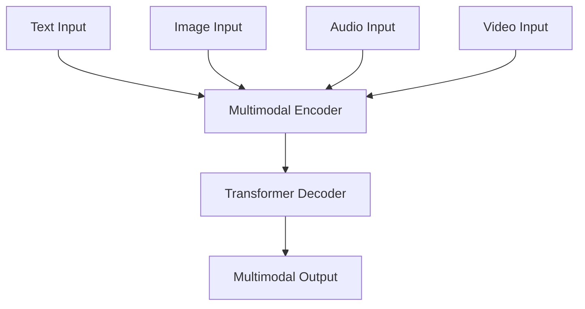

# Gemini

## Overview
> Gemini is a family of multimodal large language models developed by Google DeepMind, designed to be natively multimodal and capable of understanding and processing information across text, code, images, audio, and video.

## Architecture
Gemini models are built on top of Transformer decoders, optimized for performance across different scales (Ultra, Pro, Flash, Nano).

## Input/Output
### Input
- **Type**: Text, Image, Audio, Video, Code
- **Format**: Tokens, Pixel data, Spectrograms
- **Example**: "Describe this video of a cell dividing."

### Output
- **Type**: Text, Code
- **Format**: Tokens
- **Example**: Detailed biological description or Python script for analysis.

## Key Features
- **Native Multimodality**: Built from the ground up to reason across various modalities.
- **Long Context Window**: Support for up to millions of tokens in certain versions.
- **Efficiency**: Optimized for different tiers of hardware, from mobile (Nano) to data centers (Ultra).

## Performance
| Task | Dataset | Metric | Score |
|------|---------|--------|-------|
| General Reasoning | MMLU | Accuracy | 90.0% (Ultra) |
| Coding | HumanEval | Pass@1 | 74.4% (Pro) |

## Training Details
- **Data**: Large-scale multimodal and multilingual dataset.
- **Hardware**: Google TPU v4 and v5e.
- **Time**: Months of training.

## Usage
Available via Google AI Studio, Vertex AI, and the Gemini API.

## Strengths & Limitations
### Strengths
- Exceptional multimodal reasoning.
- Strong performance on complex coding and math tasks.
- Large context window allows for processing massive documents or videos.

### Limitations
- Potential for hallucinations typical of LLMs.
- Proprietary model with restricted access to weights.

## Related Models
- [[GPT-4]]
- [[Claude 3]]

## Notes
- Frequently used as a backend for AI-assisted research and coding tools.
