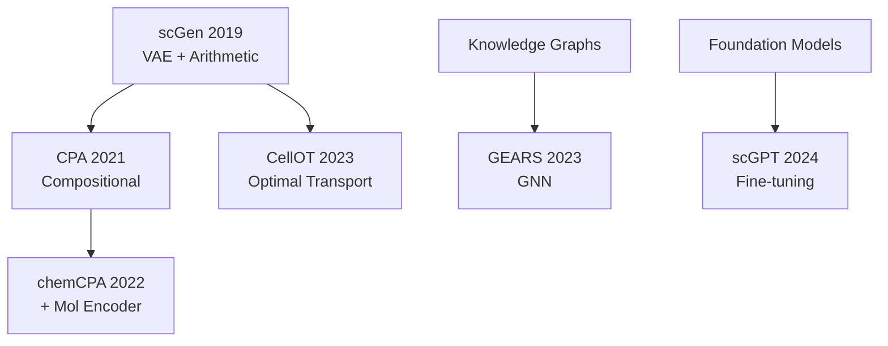
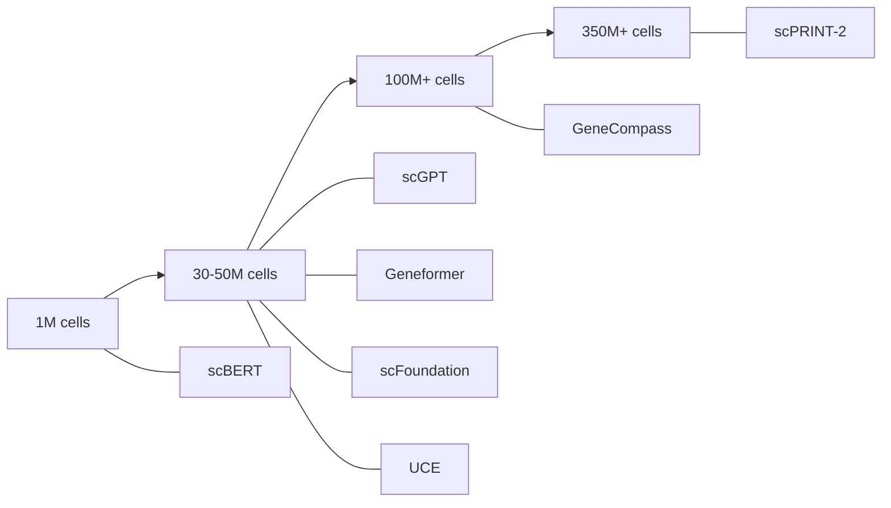

# AI Virtual Cell Models Index

## Overview
This index catalogs all models relevant to AI Virtual Cell research.

## Foundation Models

### Cell-Level Foundation Models

```dataview
TABLE year, authors, status
FROM "01_Papers"
WHERE contains(tags, "foundation-model")
SORT year DESC
```

| Model | Year | Params | Training Data | Key Innovation | Paper |
|-------|------|--------|---------------|----------------|-------|
| **scPRINT-2** | 2025 | Large | 350M cells, 16 species | Next-gen GRN inference | [[01_Papers/scPRINT\|Link]] |
| **scPRINT** | 2025 | - | 50M cells | Gene network inference | [[01_Papers/scPRINT\|Link]] |
| **scFoundation** | 2024 | 100M | 50M cells | Read-depth aware | [[01_Papers/scFoundation\|Link]] |
| **UCE** | 2024 | 650M | 36M cells, 8 species | Cross-species, ESM2 | [[01_Papers/UCE\|Link]] |
| **GeneCompass** | 2024 | 100M | 120M cells (H+M) | Knowledge-informed | [[01_Papers/GeneCompass\|Link]] |
| **CellPLM** | 2024 | - | Spatial + scRNA | Cells-as-tokens, 100x faster | [[01_Papers/CellPLM\|Link]] |
| **scGPT** | 2024 | - | 33M cells | Gene tokenization, multi-task | [[01_Papers/scGPT\|Link]] |
| **Geneformer** | 2023 | - | 30M cells | Rank-value encoding | [[01_Papers/Geneformer\|Link]] |
| **scBERT** | 2022 | - | 1M cells | First BERT for single-cell | [[01_Papers/scBERT\|Link]] |

### Model Comparison Chart

| Model | Architecture | Cross-species | Zero-shot | GRN Inference | Speed |
|-------|-------------|---------------|-----------|---------------|-------|
| scPRINT | Transformer | Partial | Yes | **Yes** | Fast |
| UCE | Transformer+ESM2 | **Yes (8)** | **Yes** | No | Medium |
| GeneCompass | Transformer | Yes (H+M) | Partial | Yes | Medium |
| CellPLM | Flowformer | No | Yes | No | **100x faster** |
| scFoundation | Asymmetric Trans. | No | Partial | No | Medium |
| scGPT | Transformer | No | Partial | Partial | Medium |
| Geneformer | Transformer | No | Yes | Partial | Medium |
| scBERT | Performer | No | No | No | Fast |

### Protein Foundation Models
| Model | Year | Task |
|-------|------|------|
| ESM-2 | 2023 | Protein embeddings |
| ESM3 | 2024 | Multimodal protein |
| AlphaFold2 | 2021 | Structure prediction |

## Perturbation Models

### Perturbation Model Papers

```dataview
TABLE year, authors, status
FROM "01_Papers"
WHERE contains(tags, "perturbation")
SORT year DESC
```

### Detailed Comparison

| Model | Year | Approach | Multi-gene | Novel Drugs | Key Innovation | Paper |
|-------|------|----------|-----------|-------------|----------------|-------|
| **GEARS** | 2023 | GNN | **Yes** | No | Knowledge graph for combinations | [[01_Papers/GEARS\|Link]] |
| **CPA** | 2023 | VAE | Yes | No | Compositional disentanglement | [[01_Papers/CPA\|Link]] |
| **CellOT** | 2023 | Optimal Transport | No | No | Distribution mapping, patient transfer | [[01_Papers/CellOT\|Link]] |
| **chemCPA** | 2022 | VAE + Mol Encoder | Yes | **Yes** | Chemical structure encoding | [[01_Papers/chemCPA\|Link]] |
| **scGen** | 2019 | VAE | No | No | Latent arithmetic (foundational) | [[01_Papers/scGen\|Link]] |

### When to Use Which Model

| Use Case | Recommended Model |
|----------|-------------------|
| Multi-gene CRISPR prediction | **GEARS** |
| Drug combination prediction | **CPA** |
| Novel drug screening | **chemCPA** |
| Patient-level generalization | **CellOT** |
| Simple perturbation transfer | **scGen** |
| Foundation model approach | **scGPT** (fine-tuned) |

### Method Evolution


## Gene Regulatory Network Models

| Model | Type | Key Feature |
|-------|------|-------------|
| **scPRINT** | Transformer | Zero-shot GRN from attention |
| **GeneCompass** | Transformer | Knowledge-informed GRN |
| CellProphet | Dynamic | Temporal GRN |
| SCENIC+ | Motif-based | TF binding motifs |
| GRNBoost2 | Tree-based | Fast inference |
| GENIE3 | Tree-based | Classic method |

## Generative Models

| Model | Architecture | Application |
|-------|--------------|-------------|
| scVI | VAE | Integration, denoising |
| scANVI | Semi-supervised VAE | Annotation transfer |
| Cell diffusion | Diffusion | State generation |
| CellOT | Optimal Transport | Cell state transitions |

## Multi-modal Models

| Model | Modalities |
|-------|-----------|
| MOFA+ | Multiple omics |
| Cobolt | RNA + ATAC |
| scMM | RNA + protein |
| MultiVI | RNA + ATAC |

## Model Comparison

### By Training Data Size


### By Primary Capability

#### Best for Cell Type Annotation
1. UCE (zero-shot)
2. scGPT (fine-tuned)
3. Geneformer

#### Best for Perturbation Prediction
1. GEARS
2. scGPT (fine-tuned)
3. scFoundation

#### Best for Gene Network Inference
1. scPRINT
2. GeneCompass
3. SCENIC+

#### Best for Cross-species Analysis
1. UCE (8 species)
2. GeneCompass (human + mouse)

#### Best for Speed
1. CellPLM (100x faster)
2. scBERT

### By Architecture Type
- **Standard Transformers**: scGPT, Geneformer, GeneCompass, scPRINT
- **Efficient Transformers**: scBERT (Performer), scFoundation (Asymmetric), CellPLM (Flowformer)
- **Hybrid (Transformer + Protein LM)**: UCE (ESM2)
- **VAE-based**: scVI, CPA, scGen
- **GNN-based**: GEARS

## Resources

### Model Repositories
- [HuggingFace Models](https://huggingface.co/models?search=single-cell)
- [GitHub Topics: single-cell-analysis](https://github.com/topics/single-cell-analysis)
- [awesome-foundation-model-single-cell-papers](https://github.com/OmicsML/awesome-foundation-model-single-cell-papers)

### Benchmarks
- [Open Problems in Single-Cell Analysis](https://openproblems.bio/)
- [Virtual Cell Challenge](https://arcinstitute.org/virtual-cell-challenge)
- [scib (Single-cell Integration Benchmark)](https://github.com/theislab/scib)

### Virtual Cells Platform
- [CZI Virtual Cell Models](https://virtualcellmodels.cziscience.com/)
