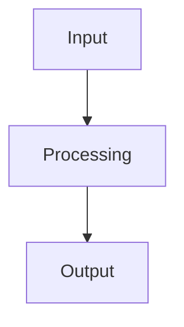

# {{title}}

## Overview
> Brief description of what this model does

## Architecture


## Input/Output
### Input
- **Type**:
- **Format**:
- **Example**:

### Output
- **Type**:
- **Format**:
- **Example**:

## Key Features
-

## Performance
| Task | Dataset | Metric | Score |
|------|---------|--------|-------|
|      |         |        |       |

## Training Details
- **Data**:
- **Hardware**:
- **Time**:

## Usage
```python
# Installation
pip install

# Basic usage
```

## Strengths & Limitations
### Strengths
-

### Limitations
-

## Related Models
- [[]]

## Notes
-
